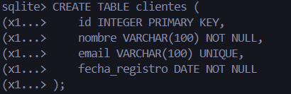
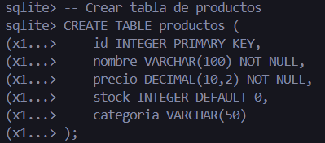
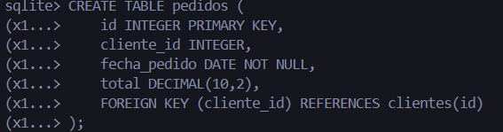
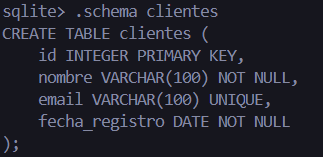

**Ejercicio**: Explorar y analizar un esquema de base de datos relacional
Ejercicio práctico para aplicar los conceptos aprendidos.

Configurar SQLite local:

# Crear base de datos de ejemplo
```sql
sqlite3 tienda_ejemplo.db
```

# Crear esquema básico:

```sql
-- Crear tabla de clientes
CREATE TABLE clientes (
    id INTEGER PRIMARY KEY,
    nombre VARCHAR(100) NOT NULL,
    email VARCHAR(100) UNIQUE,
    fecha_registro DATE NOT NULL
);



-- Crear tabla de productos
CREATE TABLE productos (
    id INTEGER PRIMARY KEY,
    nombre VARCHAR(100) NOT NULL,
    precio DECIMAL(10,2) NOT NULL,
    stock INTEGER DEFAULT 0,
    categoria VARCHAR(50)
);

-- Crear tabla de pedidos
CREATE TABLE pedidos (
    id INTEGER PRIMARY KEY,
    cliente_id INTEGER,
    fecha_pedido DATE NOT NULL,
    total DECIMAL(10,2),
    FOREIGN KEY (cliente_id) REFERENCES clientes(id)
);

```
## Explorar estructura:

### -- Ver todas las tablas
```sql
.tables
```

### -- Ver estructura de tabla específica
```sql
.schema clientes
```


### --Ver información de tabla
```sql
PRAGMA table_info(clientes);
```


## 🧩 Análisis de Constraints en la Base de Datos tienda_ejemplo.db
### 1️⃣ Columnas que NO pueden ser NULL

| Tabla         | Columnas con `NOT NULL`    | Descripción breve                                                 |
| ------------- | -------------------------- | ----------------------------------------------------------------- |
| **clientes**  | `nombre`, `fecha_registro` | Aseguran que el cliente siempre tenga nombre y fecha de registro. |
| **productos** | `nombre`, `precio`         | Garantizan que cada producto tenga nombre y precio definidos.     |
| **pedidos**   | `fecha_pedido`             | Impide registrar pedidos sin fecha.                               |

### 2️⃣ Claves Primarias y Foráneas

| Tipo de clave | Tabla       | Columna / Relación          | Descripción                       |
| ------------- | ----------- | --------------------------- | --------------------------------- |
| **PK**        | `clientes`  | `id`                        | Identificador único del cliente.  |
| **PK**        | `productos` | `id`                        | Identificador único del producto. |
| **PK**        | `pedidos`   | `id`                        | Identificador único del pedido.   |
| **FK**        | `pedidos`   | `cliente_id → clientes(id)` | Relación entre pedido y cliente.  |

### 3️⃣ Cómo las Constraints Mantienen la Integridad de los Datos

| Constraint      | Función                                               | Ejemplo en el esquema                                         |
| --------------- | ----------------------------------------------------- | ------------------------------------------------------------- |
| **NOT NULL**    | Evita que se inserten datos incompletos.              | No se puede crear un cliente sin `nombre` o `fecha_registro`. |
| **PRIMARY KEY** | Garantiza unicidad e identificación de cada registro. | Cada `id` en las tablas es único.                             |
| **FOREIGN KEY** | Mantiene integridad referencial entre tablas.         | `pedidos.cliente_id` debe existir en `clientes.id`.           |
| **UNIQUE**      | Evita duplicados en una columna.                      | `clientes.email` no puede repetirse.                          |
| **DEFAULT**     | Asigna valores automáticos cuando no se proporcionan. | `productos.stock DEFAULT 0`.                                  |
